<div align="center">


<br/><br/>

# ⎈ Production-Ready Kubernetes Application
### Self-Hosted Cluster · Kubespray · Enterprise-Grade Best Practices

*Demonstrating scalability, availability, security, and zero-downtime deployments on a fully self-managed Kubernetes cluster.*

</div>

---

## 📌 Overview

This project deploys a **production-grade application** on a self-hosted Kubernetes cluster provisioned with **Kubespray**. It implements the full spectrum of Kubernetes best practices — from workload configuration to autoscaling — mirroring real-world enterprise deployments.

---

## 🏗️ Architecture

```
                        ┌─────────────┐
                        │    User     │
                        └──────┬──────┘
                               │ HTTP/HTTPS
                        ┌──────▼──────────────┐
                        │   NGINX Ingress      │  ← Host-based routing
                        └──────┬──────────────┘
                               │
                        ┌──────▼──────────────┐
                        │   ClusterIP Service  │  ← Load balancing
                        └──────┬──────────────┘
                               │
              ┌────────────────┼────────────────┐
              │                │                │
        ┌─────▼─────┐   ┌─────▼─────┐   ┌─────▼─────┐
        │   Pod-1   │   │   Pod-2   │   │   Pod-3   │   ← Deployment
        └─────┬─────┘   └─────┬─────┘   └─────┬─────┘
              └────────────────┼────────────────┘
                               │
                  ┌────────────┴────────────┐
                  │                         │
           ┌──────▼──────┐         ┌────────▼───────┐
           │  ConfigMap   │         │     Secret      │
           └─────────────┘         └────────────────┘

           ┌──────────────────────────────────────────┐
           │          Metrics Server                  │
           │               │                          │
           │               ▼                          │
           │   Horizontal Pod Autoscaler (HPA)        │
           └──────────────────────────────────────────┘
```

---

## 🖥️ Cluster Specifications

| Component | Details |
|-----------|---------|
| **Cluster Type** | Self-hosted Kubernetes |
| **Provisioning Tool** | Kubespray |
| **Kubernetes Version** | v1.36.2 |
| **Control Plane Nodes** | 1 |
| **Worker Nodes** | 1 |
| **Container Runtime** | containerd |
| **Ingress Controller** | NGINX Ingress |

---

## 📂 Project Structure

```
K8s-production-app/
├── 📄 README.md
├── 📄 namespace.yml          # Logical isolation
├── 📄 configmap.yml          # Non-sensitive config
├── 📄 secret.yml             # Sensitive credentials
├── 📄 deployment.yml         # Workload definition
├── 📄 service.yml            # ClusterIP service
├── 📄 ingress.yml            # External routing
├── 📄 hpa.yml                # Autoscaling policy
└── 📁 screenshots/           # Verification evidence
```

---

## 🧩 Kubernetes Components

### Namespace
Provides logical isolation, scoping all resources within `k8-production` to prevent naming conflicts and enforce access boundaries.

### Deployment
Manages the application workload with:
- **Multiple replicas** for high availability
- **Rolling updates** for zero-downtime releases
- **Self-healing** to automatically replace failed Pods

### ConfigMap
Decouples configuration from container images, storing non-sensitive environment variables externally.

### Secret
Stores sensitive credentials (passwords, tokens) in a base64-encoded format with restricted access.

### Resource Requests & Limits
Guarantees fair CPU and memory allocation across all Pods, preventing any single workload from exhausting node resources.

### Liveness Probe
Continuously monitors container health — automatically restarting any container that becomes unresponsive.

### Readiness Probe
Gates traffic routing to only Pods that have fully initialized, eliminating failed requests during startup or updates.

### ClusterIP Service
Provides a stable internal IP and DNS name for load-balanced access across all running Pods.

### NGINX Ingress
Routes external HTTP/HTTPS traffic to the correct service using host-based routing rules.

### Metrics Server
Scrapes real-time CPU and memory usage from all nodes and Pods — powering HPA decisions.

### Horizontal Pod Autoscaler (HPA)
Dynamically scales the number of Pods up or down based on observed CPU utilization thresholds.

---

## 🚀 Deployment

Apply all manifests in the correct dependency order:

```bash
kubectl apply -f namespace.yml
kubectl apply -f configmap.yml
kubectl apply -f secret.yml
kubectl apply -f deployment.yml
kubectl apply -f service.yml
kubectl apply -f ingress.yml
kubectl apply -f hpa.yml
```

---

## ✅ Verification

Confirm every component is running correctly:

```bash
# Full resource overview
kubectl get all -n k8-production

# Individual component checks
kubectl get configmap  -n k8-production
kubectl get secrets    -n k8-production
kubectl get deployment -n k8-production
kubectl get svc        -n k8-production
kubectl get ingress    -n k8-production
kubectl get hpa        -n k8-production

# Node & Pod resource consumption
kubectl top nodes
kubectl top pods

# Cluster node details
kubectl get nodes -o wide
```

---

## 🏆 Production Features

| Feature | Implementation | Benefit |
|---------|----------------|---------|
| **High Availability** | Multiple Replicas | No single point of failure |
| **Zero Downtime** | Rolling Updates + Readiness Probe | Safe deployments at any time |
| **Self-Healing** | Liveness Probe | Automatic container recovery |
| **Autoscaling** | HPA + Metrics Server | Handles traffic spikes automatically |
| **External Config** | ConfigMap | Environment-specific tuning without rebuilds |
| **Security** | Kubernetes Secret | Credentials never hardcoded |
| **Resource Control** | Requests & Limits | Predictable performance under load |
| **Load Balancing** | ClusterIP Service | Even traffic distribution |
| **External Access** | NGINX Ingress | Clean host-based routing |
| **Observability** | Metrics Server | Real-time CPU & memory visibility |

---

## 📸 Screenshots

### Namespace & Pods
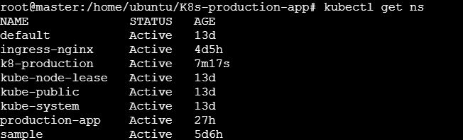
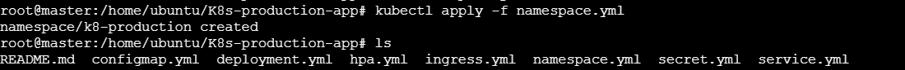
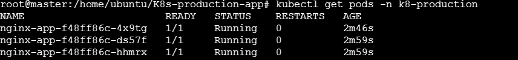

### ConfigMap
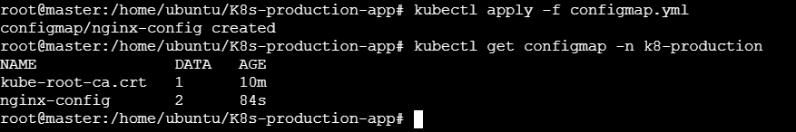

### Deployment
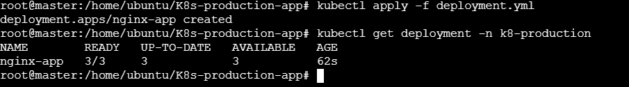

### Zero Downtime Deployment
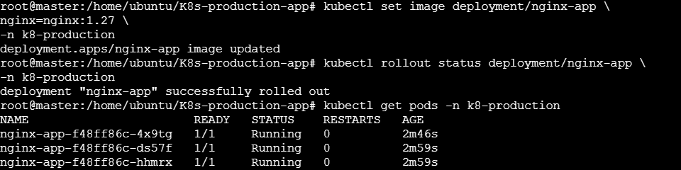
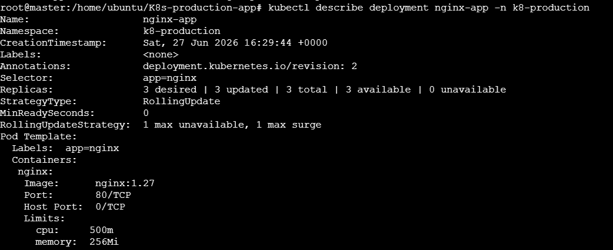

### Secret
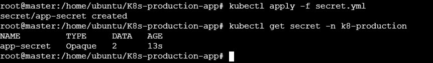

### Service
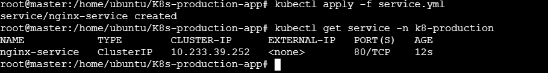
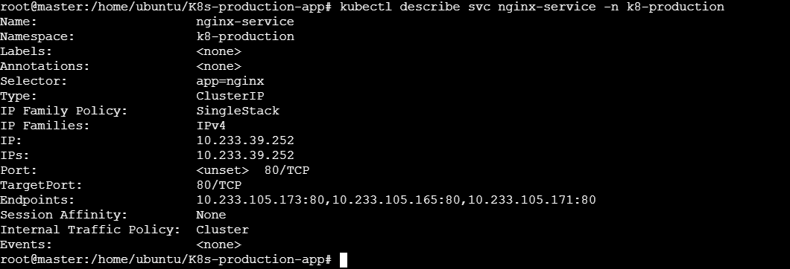

### Ingress
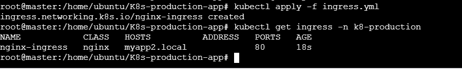
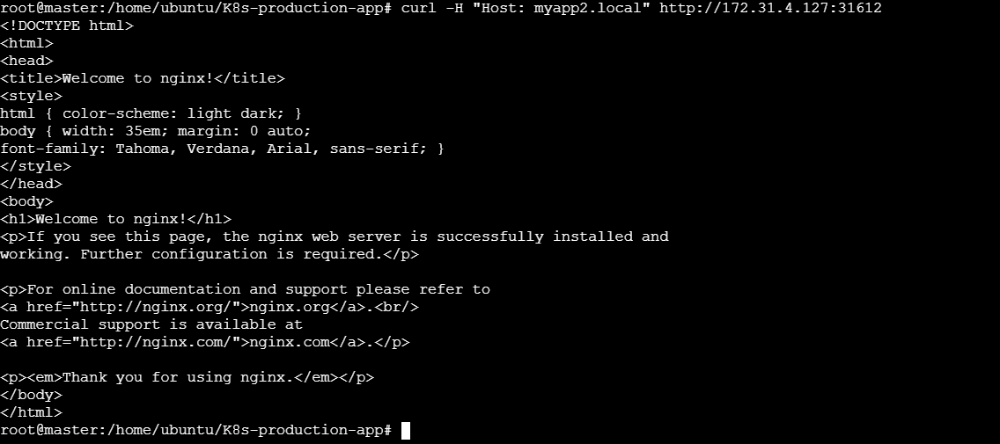

### HPA
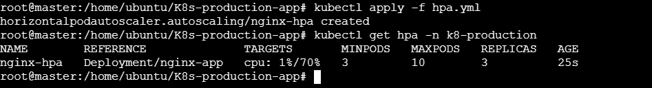

### Metrics Server


### Cluster Nodes
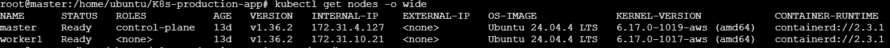

### All Resources
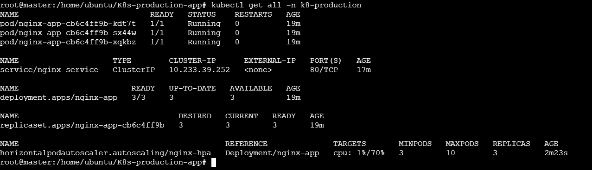

---

## 📝 Conclusion

This project demonstrates a **production-ready Kubernetes deployment** on a fully self-hosted cluster — built and provisioned using Kubespray without reliance on any managed cloud Kubernetes service. It covers the complete operational stack: workload management, secure configuration, traffic routing, observability, and intelligent autoscaling — all following Kubernetes best practices.

---

<div align="center">

**Built by [muhammedmusthafatp](https://github.com/muhammedmusthafatp)**


</div>
